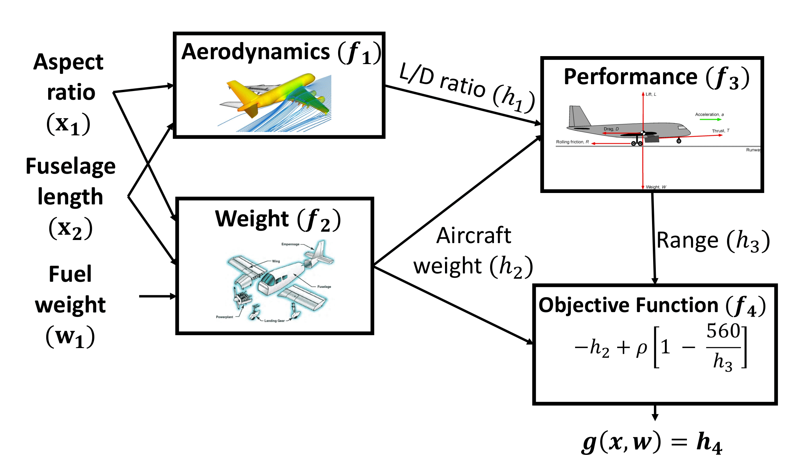
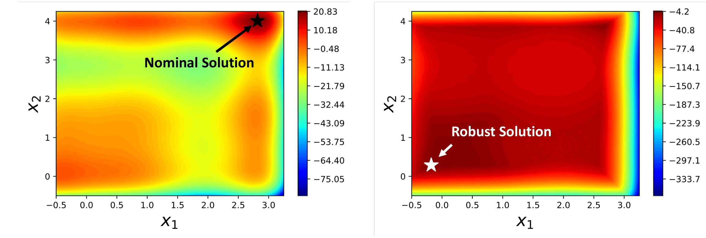

# BONSAI - Bayesian Optimization of Network Systems under uncertAInty
Uncertainties are pervasive in most real world systems and we often need to optimize the design variables of these systems in the presence of adversarial variables. Robust optimization is one such methodolgy which considers optimization in the presence of uncertainty. With this background, BONSAI looks at problems with two salient features. First feature is that oftentimes, we come accross optimization of systems with multi-disciliniary teams working on design of systems with various nodes sharing design and uncertainty variables. Below we illustrate one such example containing aircraft design problem [1]:



For the second feature, lets consider the popular polynomial function [3] which includes implementation errors such that $||\Delta x||_{2} \leq 0.5$. In the left figure we see the nominal perspective in which the implementation error is not considered, and on the right we see that the robust solution recommends a different design. Notice that implementation of nominal solution would have led to extremely poor worst-case performance; whereas with robust solution, even though we are getting slightly sub-optimal average performance, the worst-case performance is much higher than that of the nominal solution.



How does one solve the robsut optimization of system especially when each node can be a combination of black-box and white-box function? BONSAI answers this question by extending the BOFN framework [2], to include strategies to recommend designs to be robust against potentially adversarial perturbations.


## Usage
This repository also includes a .yml file of the conda environment which was used during development of the code base. [bonsai_env.yml](https://github.com/PaulsonLab/BONSAI/tree/main/BONSAI/bonsai_env.yml)

We have included all nine case studies + the illustrative example that is described in the paper for the reader's reference and reproducibility of results. You can find it in [BONSAI/case_studies](https://github.com/PaulsonLab/BONSAI/tree/main/BONSAI/case_studies). All the scripts are important but we will decribe the scripts that the user can run to replicate our results
* [search_process_step_one.py](https://github.com/PaulsonLab/BONSAI/blob/main/BONSAI/search_process_step_one.py): This is used to search over the joint design-uncertainty space using different baselines including BONSAI, ARBO, logEI, and BOFN. The search is initiated with $2(n_x + n_w) + 1$ initial points and we keep a fixed search budget of 100. Each numerical experiment is repeated 30 times with different random initializations.
* [recommendation_step_two.py](https://github.com/PaulsonLab/BONSAI/blob/main/BONSAI/recommendation_step_two.py): This is used to recommend the searched locations based on the posterior GP obtained from observed data. We have four options for recommenders - GP, GP-Quantile, GPFN and GPFN-Quantile
* [wc_performance_step_three.py](https://github.com/PaulsonLab/BONSAI/blob/main/BONSAI/wc_performance_step_three.py): This is used to observe the worst-case performance of the recommended design from the recommendation step. The code also contains some initial versions of the plotting seen in the paper (different colors, different styles)

Rest of the .py files have description and comments for further dissection. Please feel free to reach out for additional usage questions!

## References
[1] Wei Li, Mi Xiao, and Liang Gao. Improved collaboration pursuing method for multidisciplinary robust design optimization. Structural and Multidisciplinary Optimization, 59(6):1949–1968, December 2018.

[2] Raul Astudillo and Peter I. Frazier. Bayesian optimization of composite functions. 2019.

[3] Dimitris Bertsimas, Omid Nohadani, and Kwong Meng Teo. Robust optimization for unconstrained simulation-based problems. Operations Research, 58(1):161–178, February 2010


## Citation
If you use BONSAI in your work, please cite our paper. For implementation related details, please refer to the documentation or contact us!

```bibtex
@article{Kudva2026,
  title = {BONSAI: Structure-exploiting robust Bayesian optimization for networked black-box systems under uncertainty},
  volume = {204},
  ISSN = {0098-1354},
  url = {http://dx.doi.org/10.1016/j.compchemeng.2025.109393},
  DOI = {10.1016/j.compchemeng.2025.109393},
  journal = {Computers &amp; Chemical Engineering},
  publisher = {Elsevier BV},
  author = {Kudva,  Akshay and Paulson,  Joel A.},
  year = {2026},
  month = jan,
  pages = {109393}
}


